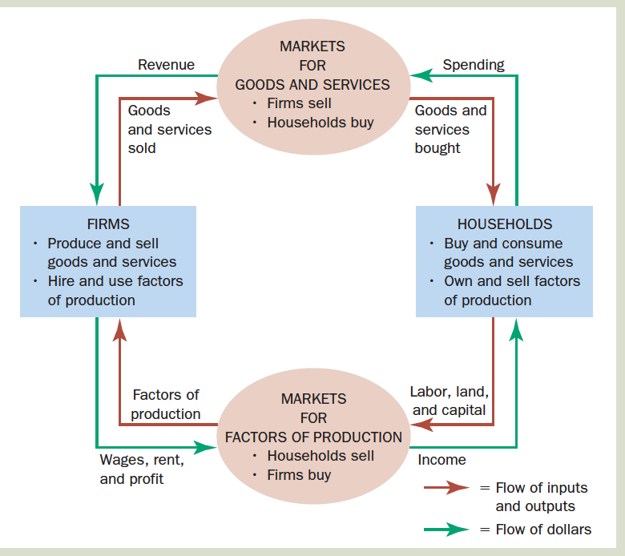
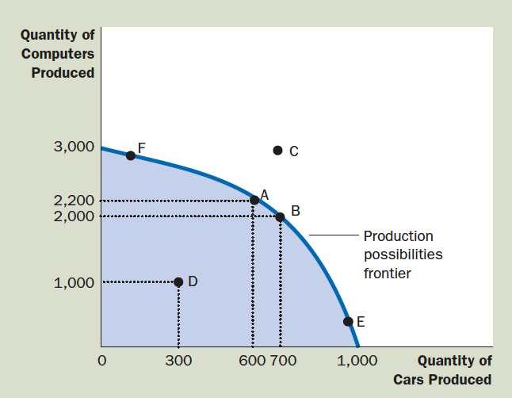

---
format:
  revealjs:
    width: 1280
    height: 720
    margin: 0.05
    theme: styles1.scss
    transition: fade
    slide-number: true
    wide: true
    chalkboard: true
    footer: "Introduction to Health Economics | Fall 2026 | Session 1"
    controls: true
    center: true
---

:::{layout = "[90,10]"}

:::{first}
[Session 1]{.kicker}

 Introduction to Health Economics

[Wu Zeng, MD, PHD, Georgetown University]{.label}

:::

:::{first}
<!-- not thing-->
:::

:::

---

## Overview

:::{.two-col-grid}

:::{.grid-item}

[1]{.accent .n-circle}

Syllabus and course overview

:::{.bullet-list}

  - Introduction of class

  - Objectives of course 

  - Course evaluation

:::

:::

:::{.grid-item}

[2]{.accent .n-circle}

Overview of economics and health economics

:::{.bullet-list}

  - [What]{.emcolor} is economics and health economics

  - [Why]{.emcolor} health economics is important

:::
:::
::::

---

## Introduce yourself 

:::{.three-col-grid}
:::{.grid-item}

[1]{.accent .n-circle}

Name and where are you from?

:::

:::{.grid-item}

[2]{.accent .n-circle}

What would you like to achieve from the class?

:::

:::{.grid-item}

[3]{.accent .n-circle}

Other information you want to share with the class?

:::
:::

---

## Instructor

::::{.two-col-grid}

:::{.grid-item}

Name: Wu Zeng ("Wu")

:::{.bullet-list}

- Epidemiology, Biostatistics, and preventive medicine
  
- Health Financing and heath systems
  
- Health Economics
  
- Economic Evaluation 

- Econometrics
  
- Research Methods
  
- Data analysis with R 
:::
:::

::: {.grid-item}

 

Office: Room [219]{.emcolor} St Mary's Hall 

Office hours: 11:30 AM - 12:30 PM on [Tuesdays]{.emcolor} or [by appointment]{.emcolor}

If you would like to join the office hour by Zoom, please email me in advance to get the Zoom link.

:::
::::

---

## Learning resources 

::::columns 
:::{.column width="50%"}
:::{.bullet-list}
- Lectures 
- Required books: Health Economics and Policy
- Case studies 
- Online resources
- Canvas 
- Instructor
- Each other
:::
:::
:::{.column width="50%"}

:::

::::

---

## Course schedule 

::::{.three-col-grid}
::: {.grid-item}

[1]{.accent .n-circle}

2.5 hours/day 

(Tuesday: 2-4:30 PM) with 2 10-minute breaks

:::

:::{.grid-item}

[2]{.accent .n-circle}

Assignments and exams

:::{bullet-list}

  - 5 assignments (every other week)
  - 1 midterm exam, and 
  - 1 final exam

:::

:::

:::{.grid-item}

[3]{.accent .n-circle}

Group presentation

:::
::::

---

## Learning objectives

::::{.six-grid}

:::{.grid-item}
[Demand for medical services]{.accent .caption}

[Understand the [factors]{.emcolor} that influence [consumer demand]{.emcolor} for medical care, including the role of prices, insurance, advertising, time, and the influence of providers]{.label}
:::

:::{.grid-item}
[Supply of medical services]{.accent .caption}

[Understand the fundamentals of hospital and physician services [production]{.emcolor}, including the concepts of input factor substitution, and economies of scale and scope.]{.label}
:::

:::{.grid-item}
[Market of medicare care]{.accent .caption}

[Understand the nature of [competition]{.emcolor} within physician services and pharmaceutical markets.]{.label}
:::

:::{.grid-item}
[Market failure of medicare care]{.accent .caption}

[Explain the primary [market failures]{.emcolor} within the [health care industries]{.emcolor} and the rationale for government intervention.]{.label}
:::

:::{.grid-item}
[Economic evaluation]{.accent .caption}

[Understanding key economic evaluation [concepts]{.emcolor} and their [application]{.emcolor}]{.label}
:::

:::{.grid-item}
[Health reforms in the US and other countries]{.accent .caption}

[Understand key trends of health care reform in the US and other countries.]{.label}
:::
::::

---

## Teaching methods 

::::{.columns}
::: {.column width="45%"}
:::{.bullet-list}
- Lectures 
- Discussions 
- Case studies (Student presentations)
:::
:::
::: {.column width="45%"}

:::
::::

---

## Evaluation and grading 1

::::{.columns}
::: {.column width="45%"}

:::{.bullet-list}
- 5 Assignments (30%)
- Midterm exam (20%)
- Final Exam (30%)
- Group presentation (15%)
- Questions submitted for presentations (5%)
:::
:::
::: {.column width="45%"}

 

 

:::
::::

:::{footnote}

1. If students miss three sessions during the semester, [F]{.emcolor} will be given

:::

---

::::{.slide-list}

:::{.list-head}

[Labtop policy]{.kicker}

Laptop and cell phone policy

:::

:::{.list-body .bullet-list}

- Use of laptops in class is [prohibited]{.emcolor}

- Note taking is not neccessary. If you want to take notes, please use [pen]{.emcolor} and [paper]{.emcolor}

- Slides will be provided [after]{.emcolor} class.

:::
::::

---

## Schedule of class

::::{.two-col-grid}
:::{.grid-item}
:::{.bullet-list}
- 9/1: Overview of health economics
- 9/15: Economic analysis Part I: Demand analysis 
- 9/22: Economic analysis Part II: Supply analysis and equilibrium 
- 9/29: Analyzing medical care markets (Abnormal market in medical care)
- 10/6: Economic evaluation in health care
- 10/13: Demand for health and medical care
- 10/20: Midterm exam
:::
:::
:::{.grid-item}
:::{.bullet-list}
- 10/27: Population health
- 11/3: Market for health insurance
- 11/10: Physicians' service market
- 11/17: The market for pharmaceuticals
- 11/24: Health systems worldwide 
- 12/1: Guest lecture: Emerging topics in global health economics
- TBD: Final essay due
:::
:::
::::

---

## What is prohibited?

:::{.three-col-grid}

:::{.grid-item}

[1]{.accent .n-circle}

Academic cheating

:::

:::{.grid-item}

[2]{.accent .n-circle}

Plagiarism
:::

:::{.grid-item}

[3]{.accent .n-circle}

Disruptive behavior in class
:::
:::

---

# Overview of health economics

---

## What is economics about?

<iframe width="868" height="488" src="https://www.youtube.com/embed/dVTNmSmUo14" title="What is Economics? An Intro to Economics" frameborder="0" allow="accelerometer; autoplay; clipboard-write; encrypted-media; gyroscope; picture-in-picture; web-share" referrerpolicy="strict-origin-when-cross-origin" allowfullscreen></iframe>

---

## Main questions for economics

- [What]{.emcolor} goods and what [quantities]{.emcolor} 

- [How]{.emcolor} are goods produced 

- How to [allocate]{.emcolor} goods 

- How [efficient]{.emcolor} is society’s production and distribution? 

---

## Concepts of economics 

::::{.three-col-grid}

:::{.grid-item}
[Commodities]{.accent .lead}

- The results of combining resources in the production process. They are either [goods]{.emcolor} or [services]{.emcolor}.
:::

:::{.grid-item}
[Resources]{.accent .lead}

- Every item within the economy that can be [used to produce]{.emcolor} and distribute goods and services; classified as [labour]{.emcolor}, [capital]{.emcolor} and [land]{.emcolor}.
:::

:::{.grid-item}
[Economics is about ...]{.accent .lead}

- limited resources (e.g. labor and capital)
- Unlimited [wants]{.emcolor} (goods or services -- commodities)
- Choosing between which [wants]{.emcolor} we can [afford]{.emcolor} given our resource [budget]{.emcolor}
:::
::::

---

## Key concepts: Utility and consumer choice

::::{.two-col-grid}

:::{.grid-item}

[Utility:]{.lead .accent}

- The [happiness or satisfaction]{.emcolor} a person gains from consuming a commodity.

[Theory:]{.accent .lead}

- people will choose consuming the amount of goods to [maximize]{.emcolor} the [utility]{.emcolor} within the budget he/she has

- MU = MC, MU is marginal utility, MC is marginal cost

:::

:::{.grid-item}

[Economics is about choice]{.accent .lead}



 

:::
::::

---

## Personal choice 

[For lunch I could have]{.accent .lead}

  - Whopper meal deal (small)
  - Tall latte and blueberry muffin (to go)
  - Tuna sandwich & cracked pepper crisps
  - Pint of Guinness & packet peanuts

---

## Key concepts: Profit and supplier/Producer choice

::::{.two-col-grid}
:::{.grid-item}
[Producer]{.accent .lead}

:::{.bullet-list}

- Profit: The difference between the revenue a firm receives from selling its goods and the costs of producing those goods.
- Theory: Firms will choose to produce the amount of goods to maximize the profit within the budget they have
- MR = MC, MR is marginal revenue, MC is marginal cost

:::
:::

:::{.grid-item}
[Consumer]{.accent .lead}

:::{.bullet-list}
- Utility: The happiness or satisfaction a person gains from consuming a commodity.
- Theory: people will choose consuming the amount of goods to maximize the utility within the budget he/she has
- MU = MC, MU is marginal utility, MC is marginal cost
:::
:::
::::

---

## Market

Definition: Any situation where people who demand a good or service can come into contact with the suppliers of that good.

::::{.two-col-grid}
:::{.grid-item}
- Decisions are made by [households]{.emcolor} and [firms]{.emcolor}.
- Households and firms interact in the markets for [goods and services]{.emcolor} (where
households are buyers and firms are sellers) and in the markets for the [factors of production]{.emcolor} (where firms are buyers and households are sellers).
- The outer set of arrows shows the flow of [dollars]{.emcolor}, and the inner set of arrows
shows the corresponding flow of [inputs and outputs]{.emcolor}.
:::

:::{.grid-item}

 

:::
::::

---

## Efficiency 

### Efficiency = making most of what we’ve got!

::::{.two-col-grid}
:::{.grid-item}

  - [Technical Efficiency]{.emcolor} = producing maximum benefit (outputs) from given inputs (resources), or given level of benefit from least inputs. 
    - *Do the things right*
  
  - [Allocative Efficiency]{.emcolor} = producing the maximum of benefits (from a given set of resources) that is most highly valued. 
    - *Do the right things*

:::
:::{.grid-item}

Production frontier

:::
::::

---

## Economists view of the world

::::{.two-col-grid}
:::{.grid-item}

:::

:::{.grid-item}

- Pessimist: bottle ½ empty

- Optimist: bottle ½ full

- Economist: bottle ½ wasted

 

Inefficient!

:::
::::

---

## Economics is

::::{.two-col-grid}
:::{.grid-item}

[Concerned with]{.accent .lead}

:::{.bullet-list}
- Costs (resource use)
- Benefits
- Choice
- Efficiency
:::
:::

:::{.grid-item}

[When choosing X, benefits $>$ the costs?]{.accent .lead}

:::{.bullet-list}
- If yes, then doing X is efficient
- If no, then doing X is inefficient
:::
:::
::::

---

##

---

## Health economics 

<iframe width="901" height="507" src="https://www.youtube.com/embed/LZZ2gyYSbzI" title="Health Economics" frameborder="0" allow="accelerometer; autoplay; clipboard-write; encrypted-media; gyroscope; picture-in-picture; web-share" referrerpolicy="strict-origin-when-cross-origin" allowfullscreen></iframe>

---

## Health economists

 

<iframe width="901" height="507" src="https://www.youtube.com/embed/pQO3EZS9ICw" title="Health economists make the world a better place | Lieven Annemans | TEDxGhent" frameborder="0" allow="accelerometer; autoplay; clipboard-write; encrypted-media; gyroscope; picture-in-picture; web-share" referrerpolicy="strict-origin-when-cross-origin" allowfullscreen></iframe>

---

## Definition of health economics

::::{.four-grid}
:::{.grid-item}
[Resource allication]{.accent .lead}

:::{.bullet-list}
- Production of health care (doctors, specialists, or nurses)
- How do we distribute health care across the population?
- How much money should the government spend on health care?
:::
:::

:::{.grid-item}

[Demonstrates the magnitude and importance of the health sector]{.accent .lead}

:::{.bullet-list}
- e.g. How fast it might be growing and why
:::
:::

:::{.grid-item}

[Uniqueness of health care]{.accent .lead}

:::{.bullet-list}

- What makes it different from other markets and how our analysis may need to adjust
:::
:::

:::{.grid-item}
[Economic determinants and governemnt policy]{.accent .lead}

:::{.bullet-list}
- Models the determinants of health status and examines how government policy might improve health status in short and long run
:::
:::
::::

---

## Structure of health economics

{width=600px}

---

# Why is health economics important

---

::::{.slide-list}
:::{.list-head}

The size of US health economy

[GDP: The market value of final goods and services produced within the borders of a country in a year]{.caption}

:::
:::{.list-body}

{width=800px}

:::
::::

---

::::{.slide-list}
:::{.list-head}

US compared to OECD countries

[Health spending per capita]{.caption}

:::
:::{.list-body}

{width=800px}

:::
::::

---

::::{.slide-list}
:::{.list-head}

Health outcomes and health spending

:::
:::{.list-body}

{width=700px}

:::
::::

---

## Questions?

::: {.incremental}

- What are the reasons for higher health care spending in the US than in other countries?
  - Supply side factors: medicine and consumption of expensive health care services
  - Demand side factor: high prevalance of obesity, and aging 
  - High input prices: drug prices (30% higher)
  - Macroeconomic status 
  - Increased health insurance coverage (~60% in 1970s to ~ 90% in 2020s)
  - High administrative costs (e.g. billing, insurance, and marketing)
- Is the fact that the US population spends more per capita on health care than people in any other developed country evidence of a failure of the US system?
:::

---

## US health system vs others 

 

<iframe width="900" height="507" src="https://www.youtube.com/embed/EBklyksgbco" title="What Does U.S. Health Care Look Like Abroad? | NYT Opinion" frameborder="0" allow="accelerometer; autoplay; clipboard-write; encrypted-media; gyroscope; picture-in-picture; web-share" referrerpolicy="strict-origin-when-cross-origin" allowfullscreen></iframe>

---

## Changes in medical care delivery in the US

- Shift from private to public financing
- Shift to third-party payment 
- Change in hosptial usage and pricing (e.g. DRG)
- Growth in managed care

---

## Where the money comes from

---

## Where the money goes 

---

## Why do we need universal health care? {visibility="hidden"}

### Robert Reich

[Why do we need universal health care?](https://www.youtube.com/watch?v=Gb9lubYzjmI)

---

## Facts about american health system 

::::{.two-col-grid}
:::{.grid-item}
:::{.bullet-list}
1. U.S. per capita health-care spending nearly quadrupled from 1980 to 2018
2. U.S. health-care spending is almost twice as high as the OECD average.
3. Most health-care spending is on hospitals and professional services.
4. Five percent of Americans accounted for half of all U.S. health-care spending in 2017.
5. Expenditures are high and variable for those with the poorest health.
:::
:::

:::{.grid-item}
:::{.bullet-list}
(6) Health-care spending per privately insured person is three times higher in some parts of the country than in others.
(7) In many cities, health-care prices vary widely for the same services
(8) U.S. health-care administrative costs are the highest of all advanced economies.
(9) Market concentration is high for specialist physicians, insurers, and especially hospitals.
(10) U.S. physician labor supply is tightly restricted.
:::
:::
::::

---

## Health and economics 

- Economics focuses on [‘utility’]{.emcolor}: the level of ‘happiness’ resulting from consumption
- Health is thus one component of utility. This has important implications:
  - Health is not the sole objective of behaviours
  - Creates trade-offs and [choices]{.emcolor} between health and other objectives – e.g. education, defence etc
- Health economics is the discipline of economics
applied to the topic of health
  - In practice, health economics is predominantly (but not solely) “health care” economics: goods and services produced (by health sector) primarily to affect health status

---

## Final word...

- Health economics is the application of economics to the study of health and health care

- It is important because:

  - Health is important to us
  
  - Health is affected by our choices
  
  - The health sector is very significant to the economy
  
  - Decisions in health (care) often determined by economic environment

- (Health) economics is [not]{.emcolor} concerned with saving money, but with improving people’s lives

- Health economics is quite literally [a matter of life and death!]{.emcolor}

---

## Comments and questions? 

